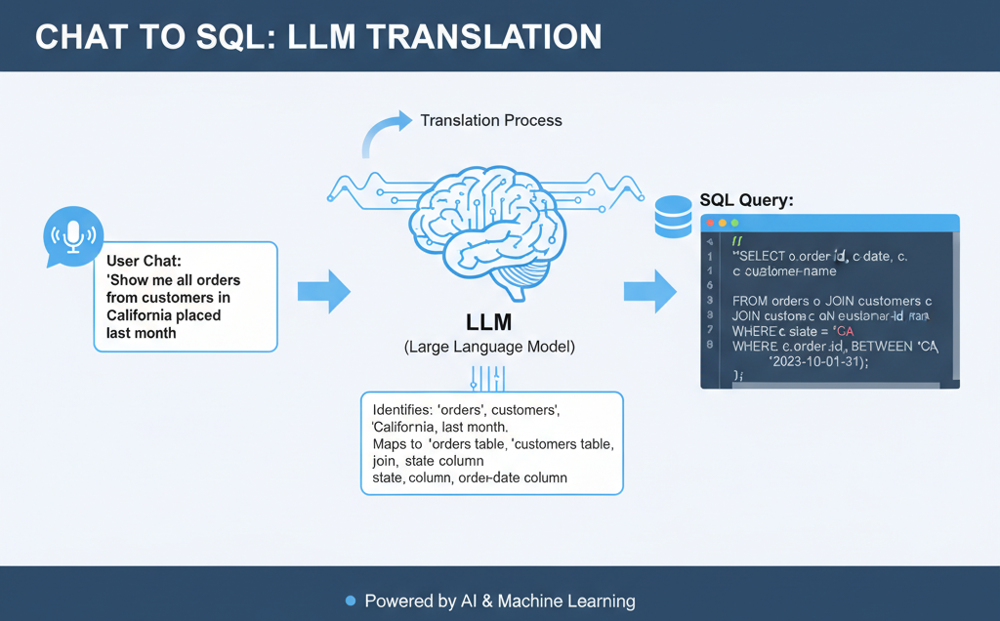
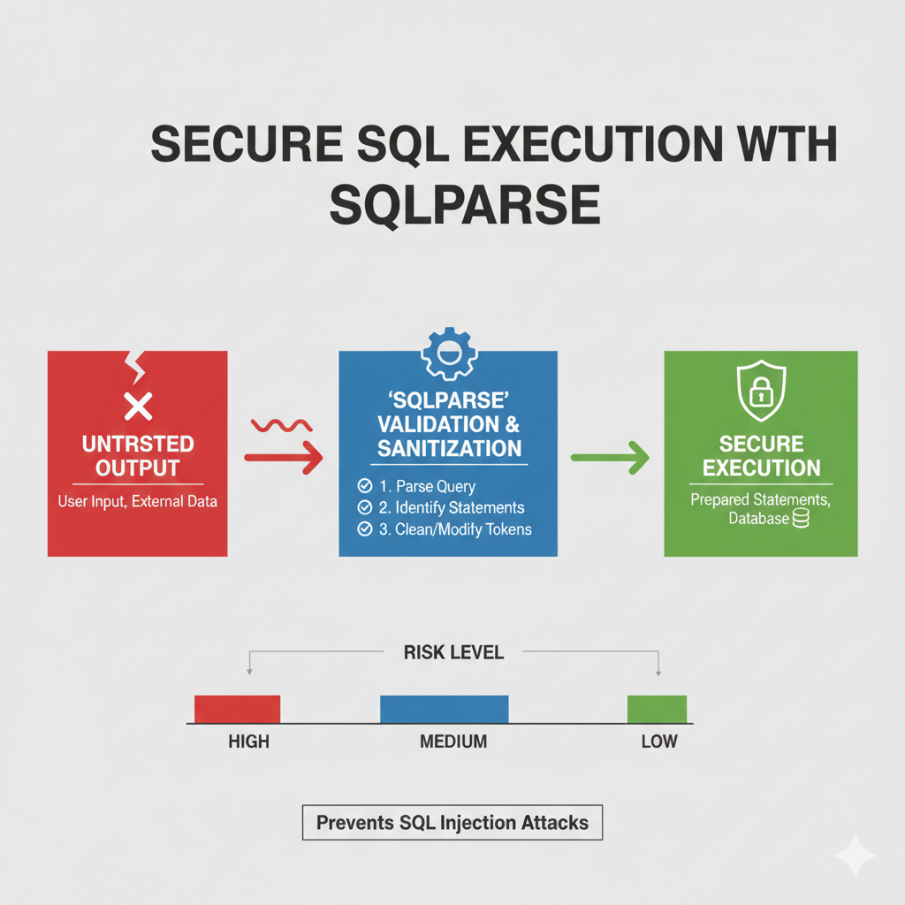

# Simple SQL Query Generator using LLMs

> Transform natural language into SQL queries with the power of Large Language Models

[](https://www.python.org/downloads/)
[](https://opensource.org/licenses/MIT)
[](https://www.openai.com)

## Overview

A production-ready SQL query generator that converts natural language questions into accurate, safe SQL queries. Built with schema awareness, safety validation, and support for multiple LLM providers.

## **Medium Article:** [Building a Simple SQL Query Generator Using LLMs](https://pub.towardsai.net/building-a-simple-sql-query-generator-using-llms-2a18c80151c6)


## **Medium Article:** [SQL Parsing and Validation for LLMs: A Comprehensive Guide](https://pub.towardsai.net/sql-parsing-and-validation-for-llms-a-comprehensive-guide-4e33aef586cc)


## Features

✅ **Natural Language to SQL** - Ask questions in plain English  
✅ **Multi-Provider** - Configured to work with OpenAI, Anthropic, or local LLMs  
✅ **Multiple Dialects** - Configured for PostgreSQL, MySQL, SQL Server  
✅ **Safety First** - Validates queries before you can execution  

## Quick Start

### Prerequisites

- Python 3.8+
- SQL Server database
- API key from OpenAI or Anthropic

### Installation

```bash
# Clone the repository
git clone https://github.com/sainathudata/simple_sql_query_generator_llm.git
cd sql-query-generator_llm

# Install dependencies
uv sync
```

## Architecture

```
Natural Language Question
        ↓
Database Schema Context
        ↓
LLM Query Generator
        ↓
Generated SQL Query
        ↓
Validate Generated SQL Query
```

### Components

1. **Schema Extractor** - Reads database structure and formats it for LLM context
2. **Query Generator** - Converts natural language to SQL using LLM


## Project Structure

```
sql-query-generator/
├── schema_extractor.py           # Database schema extraction
├── simple_query_generator.py     # LLM integration
├── main.py                       # Main application logic to verify chat to sql
├── sql_parse.py                  # Verify the sql parse output for given sql (newly add)
├── sql_validation.py             # SQL Validator (newly add)
├── main.py                       # Main application logic to validate the sql generated by llm (newly add)
├── pyproject.toml                # Python dependencies
└── README.md                     # This file
```

## Configuration

### Environment Variables

Create a `.env` file with:

```bash
# LLM Provider (choose one)
ANTHROPIC_API_KEY=your_anthropic_key_here
OPENAI_API_KEY=your_openai_key_here

# Database Configuration
DB_HOST=localhost
DB_PORT=5432
DB_NAME=your_database
DB_USER=your_username
DB_PASSWORD=your_password
```

### Supported Databases

- SQL Server (default)
- MySQL
- PostgreSQL
- SQLite

Update the connection parameters in your `.env` file accordingly.

## Examples


## Troubleshooting

### Common Issues

**1. "Invalid SQL syntax" errors**
- Check your database dialect setting
- Verify schema extraction is working
- Review the generated query

**2. "API rate limit exceeded"**
- Add delays between requests
- Implement request caching
- Use a higher tier API plan

**3. "Connection timeout"**
- Check database credentials
- Verify network connectivity
- Increase timeout settings

**4. Low accuracy**
- Improve schema descriptions
- Improve system prompt
- Add column comments
- Provide example queries in prompt
- Try a different llm model

## Contributing

Contributions are welcome! Please:

1. Fork the repository
2. Create a feature branch (`git checkout -b feature/amazing-feature`)
3. Commit your changes (`git commit -m 'Add amazing feature'`)
4. Push to the branch (`git push origin feature/amazing-feature`)
5. Open a Pull Request

## Roadmap

- [ ] Support for more databases (Oracle, MongoDB)
- [ ] Query optimization suggestions
- [ ] Natural language result explanations
- [ ] Multi-user authentication
- [ ] Query history and favorites
- [ ] Export results to CSV/Excel
- [ ] Chart generation from results
- [ ] Slack/Discord integration

## License

This project is licensed under the MIT License - see the [LICENSE](LICENSE) file for details.

## Acknowledgments

- Built with [Ollama](https://ollama.com) and [OpenAI GPT](https://openai.com)
- Inspired by the need to make data accessible to everyone
- Thanks to the open-source community

## Contact

- **Author:** Sainath Udata
- **LinkedIn:** [Sainath Udata](https://www.linkedin.com/in/sainath-udata/)
- **Medium:** [Sainath Udata](https://medium.com/@sainath.udata)

## Citation

If you use this project in your research or work, please cite:

```bibtex
@misc{sql-query-generator,
  author = {Sainath Udata},
  title = {SQL Query Generator using LLMs},
  year = {2026},
  publisher = {GitHub},
  url = {https://github.com/sainathudata/simple_sql_query_generator_llm}
}
```

---

**Built with ❤️ by an analyst who was tired of writing the same JOINs over and over.**

**Star ⭐ this repo if you found it helpful!**